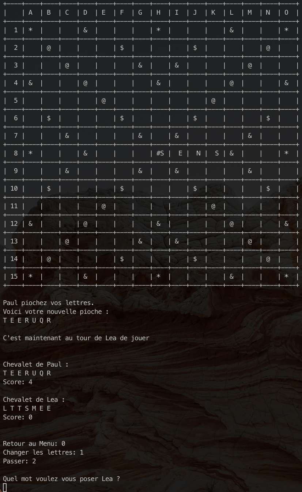

# Scrabble
An easy to play Scrabble CLI game developped in C

## Features 
 - Multiplayer game (Up to 4 person)
 - Anti Cheat algorith which detect if a word exist
 - AI implemented for a solo game
 - Command Line Interface Game

## Build 
```
gcc -o exec Fscrabble.c
./exec
```

## GUI

